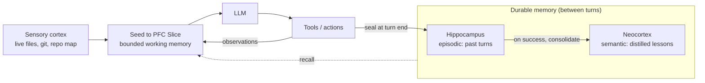

# memagent

A **memory-native coding agent**. Its core bet is a different memory model from every mainstream agent:

> **Don't accumulate the transcript — reconstruct a small, deterministic working state every turn.**

Mainstream agents accumulate a growing message history and **LLM-summarize it when it nears the context window** ("transcript + compaction"). memagent never accumulates: each turn it rebuilds a bounded **Active Memory Slice** from ground truth — the live files, the last error (verbatim), a counted action tally, recent actions, and retrieved context — and sends only that.

## Why

- **Bounded by construction** — per-turn context stays flat regardless of session length (no grow-to-window sawtooth).
- **Faithful** — context is re-read from ground truth, not a lossy summary of the conversation.
- **Auditable** — you can print the exact, small input the model saw each turn and know *why* it decided.
- **Cheap at scale** — validated: on long/iterative tasks the slice cut tokens up to ~60–80% and wall-clock ~70% vs a transcript loop, with identical test pass rates.

This is the opposite of the field's default ("bigger windows + summarize"): **remember less, reconstruct precisely.**

## How it works — the brain model

memagent's memory is organized like a brain: fast, lossy **perception** of the live world; a small **working memory** for the current task; a **hippocampus** that records what just happened; and a **neocortex** that distills durable lessons. Every turn *reconstructs* a bounded working set from these — it never replays a growing transcript.

| Region | Module | Role |
|---|---|---|
| **Sensory cortex** — live perception | `sensory_cortex.py` | Re-derives the world each turn: git state, project facts, repo map. Never stored or recalled. |
| **Prefrontal cortex** — working memory | `pfc.py` | The carried **Slice**: bounded, provenance-tagged state (findings, plan, change-set), sealed at each turn boundary. |
| **Hippocampus** — episodic memory | `hippocampus.py` | Losslessly records each turn; `recall_history` pages a specific past turn back in on demand. |
| **Neocortex** — long-term memory | `neocortex.py` | Distills successful episodes into durable cross-session lessons, auto-surfaced when relevant. |



Each turn, `seed.py` faults in exactly what the turn references — the carried PFC slice, live sensory-cortex views, and any relevant neocortex lessons — and hands the model that bounded **Seed**. The model acts; observations fold back into working memory; at the turn boundary the episode is sealed into the hippocampus; on success, the neocortex consolidates it into a durable lesson. Net effect: **per-turn context stays flat no matter how long the session runs.**

## Status

Early, but the **core bet is validated** — see the measured head-to-head benchmarks below. The production build is Python and aligns with [memem](https://github.com/TT-Wang/memem).

## Install

**One command** — installs `uv` if needed, then memagent in an isolated tool env:

```bash
curl -fsSL https://raw.githubusercontent.com/TT-Wang/memagent/main/install.sh | sh
```

Prefer to run it yourself (any one of):

```bash
uv tool install "memagent[tui] @ git+https://github.com/TT-Wang/memagent"    # uv
pipx install "memagent[tui] @ git+https://github.com/TT-Wang/memagent"       # pipx
docker run -it -e LLM_API_KEY=$LLM_API_KEY -v "$PWD:/work" -w /work ghcr.io/tt-wang/memagent   # container
```

Footprint is light (no torch). `pip install -e .` works for a clone too. PyPI / Homebrew arrive in v0.2 once `memem` is on PyPI.

## Quickstart

```bash
memagent init            # guided setup: provider, API key, model → ~/.memagent/config.toml (tests your key)
memagent                 # start the agent
```

`init` writes the config so the next run needs no env vars. Already have them? `export LLM_API_KEY=…
[LLM_BASE_URL=…]` and skip `init`. Discover every setting with `memagent config --list`.

→ Full walkthrough in **[QUICKSTART.md](QUICKSTART.md)** · **[CONTRIBUTING.md](CONTRIBUTING.md)** · **[CHANGELOG.md](CHANGELOG.md)**

## Benchmarks

The bet — *flat per-turn cost from reconstruction, at capability parity* — is measured, not asserted. All runs use `gpt-5.5`.

**The moat: per-turn input stays flat while a transcript grows.** Head-to-head vs Kimi Code (a strong transcript-based agent) on hard multi-turn tasks:

| Scenario | memagent peak input | Kimi Code peak input | ratio |
|---|--:|--:|:-:|
| long-horizon debug | **7.5k** | 64.5k | **8.6×** |
| large-file bug | **7.7k** | 37.0k | 4.8× |
| multi-file refactor | **5.9k** | 28.2k | 4.8× |

Across a broader 22-scenario set: median peak input **10k (memagent) vs 23k (Kimi Code)** — and memagent's per-turn input barely moves (2.6k → 7.5k over 50 steps) while the transcript climbs 16k → 64k.

**Capability is at parity on these samples.** 22/22 vs 21/22 passed on the parity set; on 3 SWE-bench Verified instances memagent resolved 1/3 (scored by the official harness); TerminalBench-core standalone accuracy 0.625 (N=16).

**Same work, far fewer tokens.** On SWE-bench Lite vs a transcript agent, same instances: **26 steps / 284k tokens vs 63 steps / 838k** — ~2.4× fewer steps, ~3× fewer tokens (both resolved 0/3 — underdetermined instances, equal capability).

> Numbers are small-N and honestly reported: the consistent, reproducible signal is the **flat per-turn cost**, not a capability leap. The win shows up in **multi-turn real use** (where a transcript grows), not single-turn SWE-bench (which structurally can't show it).

## Under the hood

The core is `openai`-free (only `llm.py`/`cli.py` import the SDK), so the whole loop is testable offline with a fake LLM. Layout under `src/memagent/`:

- **moat:** `pfc.py` (the `Slice` dataclass, typed tiers, `slice_sink`) + `seed.py` (the reconstruction seam `make_build_slice`) + `prompt.py` (`SYSTEM_PROMPT`), `loop.py` (`run_turn`/`run_step` — stateless core over contracts).
- **contracts:** `interfaces.py` (`LLMClient`/`ToolHost`/`Retriever`/`Oracle`), `events.py` (the loop's only output path), `hooks.py` (policy seam: `OracleHook`/`PermissionHook`/`BudgetHook`).
- **engineering:** `access.py` + `scheduler.py` (resource-conflict model → safe parallel tools), `errors.py` (error classification + retry/backoff), `sandbox.py` (execution backend), `policy.py` (permission chain).
- **default impls:** `tools.py` (`LocalToolHost`), `llm.py` (`OpenAILLM`), `code_index.py` (`RipgrepCodeIndex`) + `retriever.py` (`NullRetriever`), `oracle.py`, `cli.py` (event-sink host).

The loop dispatches events; the host composes sinks (slice-updater, durable log, terminal). Ships a local `ToolHost` (workspace-confined file ops + sandboxed shell) and a ripgrep-backed `CodeIndex` (falls back to `NullRetriever` when `rg` isn't on PATH).

**Safety (P1.5).** Two independent layers:
- *Safe execution* (`tools.py` + `sandbox.py`): file ops are confined to the workspace root — path traversal out of it is rejected — and shell runs through a `Sandbox` backend. `BaseSandbox` owns output capping; backends implement `_exec()`: **`LocalSandbox`** (subprocess, cwd-confined, timeout, **secret-env scrubbing** so model-run commands can't read your API keys) and **`DockerSandbox`** (container — workspace bind-mounted same-path, network off by default, only configured env enters). Pick via `AGENT_SANDBOX`/`[sandbox]`. Code-as-action stays backend-portable via `sandbox.python_cmd`.
- *Authorization* (`policy.py`): an ordered `PolicyChain` behind the `PermissionHook`. Three modes via `AGENT_POLICY`, **all of which block catastrophic commands** (`rm -rf /`, `sudo`, `curl … | sh`, writes to `/etc`, key/cred reads, force-push): **`teenager`** (default — auto-applies file edits, asks before shell commands), **`baby-sitter`** (asks before every edit *and* command; "always" memorizes for the session), **`let-it-go`** (runs everything except the catastrophic floor). A non-interactive/headless run auto-proceeds on a confirm-mode (still catastrophic-gated); legacy `guard`/`ask`/`readonly`/`allow` still resolve. Hooks can also mutate via `prepare_messages` (inject context before the LLM call) and `transform_tool_result` (rewrite/redact output before it enters the slice).

**Subagents (`spawn_subagent`).** The slice thesis applied recursively: for large, decomposable work the model delegates a self-contained sub-task to a child agent. The child runs its OWN loop with a fresh slice in the SAME workspace, then returns **only a compact summary** — the parent's slice never sees the child's transcript, so parent context stays bounded no matter how much the child did. It's a ToolHost wrapper (`subagent.py`), so the loop is unchanged (one tool call → a summary string); depth-capped (`AGENT_SUBAGENT_DEPTH`, default 1) against runaway recursion, and the child runs under the same permission policy. Verified live: the model delegated two modules to two children that produced correct code, with the parent slice holding only the two `spawn_subagent` summaries.

**Code-as-action (`execute_code`).** Beyond one-call-per-tool, the model can write a single Python script that performs many file/shell actions and prints one short result — collapsing N tool round-trips into one turn (the strongest context reducer). The script runs **in the LocalSandbox** (cwd-confined, secret-scrubbed, timed-out) with a no-import helper API (`read_file`/`write_file`/`append_file`/`str_replace`/`list_files`/`run`); the workspace is on `sys.path` so freshly-written modules import cleanly. Only stdout returns. Files it reads/edits via the helpers are folded back into the OPEN FILES working set (paths parsed from the script), so code-as-action coheres with the slice instead of bypassing it — the agent doesn't re-read what a script already touched. It carries the same trust level as `run_command` (arbitrary execution) and is gated by the same policy (`readonly` blocks it). RPC-back-to-parent for parent-only tools (memem/MCP) is the documented upgrade.

**Extensions (MCP · skills · plugins).** memagent extends through one tool registry that every source feeds:
- *MCP* (`mcp_client.py`): declare servers in `[mcp_servers.*]`; their tools appear as `mcp__server__tool` (official MCP SDK, stdio).
- *Skills* (`skills.py`): `SKILL.md` prompt-packs (see above) discovered from `.memagent/skills`.
- *Plugins* (`plugins.py`): a directory with `plugin.toml` + an `__init__.py` exposing `register(ctx)`. Through `ctx` a plugin contributes tools/skills/MCP-servers/hooks into the **existing** seams — no privileged surface; plugin tools run through the same sandbox + policy + scheduler. Discovered from `.memagent/plugins` (+ `[plugins].dirs`). See [`examples/plugins/hello`](examples/plugins/hello).

**Code-discovery tier (CodeIndex).** `code_index.py` fills the RELATED CODE tier from a real repo: each turn it ripgreps the working tree for the identifiers in the task **plus the current error** (which usually names the missing symbol), ranks files by how many distinct query terms they hit, and returns line-numbered context windows — deterministic, no embeddings, no network. `repo_map()` gives a compact file→definitions skeleton for orientation (not folded into every turn, to keep context bounded). tree-sitter is the precision upgrade for definition extraction (drop-in at `_defs_in()`); v1 uses ripgrep + regex.

**Memory tier (memem) — a closed read/write loop.** `memory.py` plugs [memem](https://github.com/TT-Wang/memem) in as the cross-session `Memory` (the RELEVANT MEMORY tier). It's behind the `Memory` interface; memem indexes a curated lesson vault, *not* source code (code discovery is the separate `CodeIndex` above).
- *Read:* each task recalls relevant lessons via memem's hybrid retrieval into the slice.
- *Write (`neocortex.py`):* after a task **succeeds**, consolidation distills a durable lesson from what happened and `remember()`s it — so a future similar task recalls it. This is what makes memagent memory-*native*. It's an event sink, signal-dense by construction: it mines **only a validated episode** (a successful turn in which an error was hit and then cleared — no error / no success / no lesson), dedups within a session, and prints `💡 learned: …`. `AGENT_MINE=deterministic` (default — cheap, no extra LLM call) | `llm` (one-shot distillation for a crisper lesson) | `off`.

Configure via **`memagent.toml`** (persistent; see [`memagent.toml.example`](memagent.toml.example)) or env vars (one-off overrides). Precedence: env > project `memagent.toml` > user `~/.memagent/config.toml` > default. Keys: `AGENT_POLICY` (`baby-sitter`/`teenager`/`let-it-go`), `AGENT_MINE`, `AGENT_SUBAGENT_DEPTH`, `AGENT_MODEL`, `MEMEM_VAULT` (enable memem), `AGENT_VERIFY_CMD` (tests as the Oracle), `AGENT_MAX_TOKENS`, `SHOW_SLICE=1`; plus `[skills]`, `[mcp_servers]`, `[plugins]` sections.

## Architecture (build / plug / integrate)

The discipline: **own the thin differentiated core, keep the thick commodity periphery on well-known building blocks.**

- **Build (the moat):** the slice loop, the typed memory tiers + per-tier compaction, the reconstruction. Plus thin glue: permission gate, verification orchestration, subagents, resume.
- **Plug:** [memem](https://github.com/TT-Wang/memem) as the retrieval + cross-session memory engine (behind a `Retriever` interface).
- **Integrate:** LLM SDKs, tree-sitter (repo map), ripgrep (search), a container sandbox, MCP (tool breadth), a TUI lib, SWE-bench (evals).

## The differentiator, in one line

> **Deterministic reconstruction from ground truth** — vs the incumbents' **accumulate-then-LLM-summarize**.

## License

**MIT** — see [LICENSE](LICENSE). Third-party components and their licenses are listed in [NOTICE](NOTICE).

Security policy + threat model: **[SECURITY.md](SECURITY.md)**.

## Acknowledgments

memagent's design was informed by two excellent open-source agents: **[Hermes](https://github.com/NousResearch/hermes)** (MIT) and **[Kimi Code](https://github.com/MoonshotAI/kimi-code)**. A few peripheral utilities are ported from Hermes (see [NOTICE](NOTICE)); most of the rest are patterns we studied and reimplemented on our own terms. With thanks to their authors.
