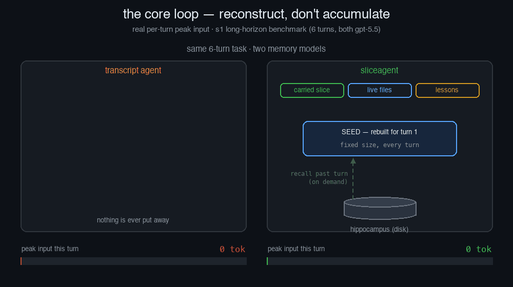

# sliceagent

[](https://github.com/TT-Wang/sliceagent/actions/workflows/ci.yml) [](https://pypi.org/project/sliceagent/) [](LICENSE) [](pyproject.toml)

> **A coding agent that reconstructs a history-bounded, task-elastic working context every turn — instead of accumulating a chat transcript and summarizing it when it overflows.**

That one change is the whole product. Because context is reconstructed from active semantic state and live ground truth each turn rather than piled up:

- **History-bounded cost** — when active task state stays stable, per-turn input does not grow merely because the session is older; there is no transcript-driven grow-to-window sawtooth.
- **Task-elastic focus** — simple tasks stay lean, while real user constraints, coupled files, and unresolved evidence can expand the working slice when needed.
- **Recoverable live state** — every turn re-observes relevant workspace state and faithfully carries current failures; retired detail pages out behind stable handles instead of forcing routine transcript compaction.

The field's default is *bigger windows + summarize*. sliceagent does the opposite: **carry what remains active; archive and recover the rest.**

*Pre-1.0: on `0.x`, CLI flags, config keys, and APIs may change between releases; breaking changes are noted in the [CHANGELOG](CHANGELOG.md).*

**Contents:** [How it works](#how-it-works) · [Benchmark](#benchmark) · [Install & quickstart](#install--quickstart) · [Usage](#usage) · [License](#license) · [Acknowledgements](#acknowledgements) · [Contact](#contact)

## How it works

<p align="center">
  
</p>

sliceagent's memory is organized like a brain: fast, lossy **perception** of the live world; an elastic **working memory** for the current task; a **hippocampus** backed by always-on local artifacts; and an optional **neocortex** that derives durable lessons. Every turn *reconstructs* a history-bounded working set from these — it never replays a growing transcript.

| Region | Role |
|---|---|
| **Sensory cortex** — live perception | Re-derives the world each turn—git state, project facts, repo map—rather than trusting remembered copies. |
| **Prefrontal cortex** — working memory | The carried **Slice**: task-elastic, provenance-tagged state (intent, findings, plan, change-set), sealed at each turn boundary. |
| **Hippocampus** — episodic memory | Seals each turn or child report into the always-on local artifact store; pages a specific record back in on demand. |
| **Neocortex** — long-term memory | Optionally derives and retrieves provenance-tagged cross-session lessons; it is not required for task recovery. |

```text
┌───────────────────┐ ┌───────────────────┐ ┌───────────────────┐ ┌───────────────────┐
│        PFC        │ │  Sensory Cortex   │ │    Hippocampus    │ │     Neocortex     │
│  working memory   │ │  live perception  │ │  episodic memory  │ │  durable lessons  │
└─────────┬─────────┘ └─────────┬─────────┘ └─────────┬─────────┘ └─────────┬─────────┘
          │                     │                     │                     │
          └─────────────────────┴──────────┬──────────┴─────────────────────┘
                                           ▼
      ┌────────────────────────────────────────────────────────────────────────┐
      │            GLOBAL WORKSPACE  —  this turn's reconstructed seed           │
      │        (carried slice + live views + relevant lessons + prompt)         │
      └────────────────────────────────────────────────────────────────────────┘
                                           ▼
                         ┌───────────────────────────────────┐
                         │             LLM turn              │
                         │ tool calls accumulate within-turn │
                         └───────────────────────────────────┘
                                           ▼
                      ┌─────────────────────────────────────────┐
                      │  PFC updated · turn sealed to artifact  │
                      └─────────────────────────────────────────┘

  ↻  next turn: the active slice remains resident;
     live views re-derive, archived detail returns by handle.
```

Each turn faults in what the active task references — the carried slice, live views, selected artifacts, and any relevant derived lessons — and hands the model an elastic **Seed**. The model acts; observations fold back into working memory; at the turn boundary the episode is sealed into an immutable local artifact and the next checkpoint is published. If semantic memory is available, it may additionally distill a durable lesson. Net effect: **for stable active task state, context does not grow merely with session age; it can still expand with genuine task complexity.**

## Benchmark

On public benchmarks, sliceagent matches Codex's solve rate while using 2.5× fewer tokens and 1.3× less cost on ColBench, and up to 149× smaller peak input on long sessions.

Two questions decide whether reconstructing context every turn actually works: does it stay as **capable** as a transcript agent, and does it keep **per-turn cost history-bounded as the session grows** — sized to the current task, not the accumulated history? All four benchmarks are head-to-head vs **OpenAI Codex** on the same model (`gpt-5.5`) — the fourth adds a third question: what does it cost to *orchestrate a subagent fleet*.

### 1. In-turn capability — Terminal-Bench 2.0 (public)

A TB2.0 task is a single turn, so it's a clean test of raw within-turn ability. On the 32 tasks both agents completed cleanly:

| metric | sliceagent | OpenAI Codex |
|---|--:|--:|
| **pass rate** | **18 / 32 (56%)** | 18 / 32 (56%) |
| wins (exclusive) | 4 | 4 |
| median steps / task | **10** | 27 |

**Dead even, 4 wins each** — reconstruct-every-turn matches a state-of-the-art agent on in-turn tasks with no capability tax.

### 2. Multi-turn — ColBench (public: Meta SWEET-RL)

Collaborative coding over multiple rounds with a simulated human — the memory model *does* matter here. 20 backend tasks, both `gpt-5.5` at `high`:

| metric | sliceagent | OpenAI Codex | % of Codex |
|---|--:|--:|:--:|
| **solved** | **20 / 20** | 20 / 20 | parity |
| peak input · median | **5,191** | 13,415 | **39%** |
| peak input · mean | **5,188** | 13,424 | **39%** |
| input tokens · total | **284k** | 760k | 37% |
| ↳ served from cache | 50% | 57% | — |
| output tokens · total | 24.3k | 8.8k | 276% |
| **total tokens** | **308k** | 769k | **40%** |
| rounds · median | 3 | 3 | — |
| wall · median/turn | 26s | 26s | 100% |
| **cost** (cache-aware $) | **$0.44** | $0.55 | **80%** |

Same capability — **2.6× smaller per-turn context, 2.5× fewer tokens, 1.3× cheaper**, at parity wall.

### 3. Long-horizon multi-turn — self-designed coding scenarios

Iterative coding sessions where a transcript really piles up. Each scenario is a **fixed sequence of 6–10 dependent, pre-written turns revealed one at a time** — later turns build on (and regress) earlier work, so **no agent can one-shot them** and byte-identical turns go to both agents. Both `gpt-5.5` at `high`. Reproduce with [`benchmarks/run.py`](benchmarks/) (the scenarios are in [`benchmarks/multiturn_coding/`](benchmarks/multiturn_coding)):

| metric | sliceagent | OpenAI Codex | % of Codex |
|---|--:|--:|:--:|
| **solved** | **3 / 3** | 3 / 3 | parity |
| peak input · median | **16,330** | 2,075,987 | **0.8%** |
| peak input · mean | **16,734** | 2,056,732 | **0.8%** |
| input tokens · total | **2.21M** | 26.4M | 8% |
| ↳ served from cache | 84% | 91% | — |
| output tokens · total | **63.4k** | 355.4k | 18% |
| **total tokens** | **2.28M** | 26.7M | **9%** |
| wall · total | **1,069s** | 1,761s | **61%** |
| **cost** (cache-aware $) | **$1.30** | $9.43 | **14%** |

Per task—the transcript agent's peak input scales with the session while the slice remained within a narrow band in these runs:

| scenario | agent | solved | peak input | total tokens | wall |
|---|---|:--:|--:|--:|--:|
| **s1** long-horizon debug (6 turns) | sliceagent | ✓ | **14,769** | 499k | 257s |
| | Codex | ✓ | 1,655,714 | 5.17M | 465s |
| **s2** dependency-DAG scheduler (10 turns) | sliceagent | ✓ | **19,104** | 924k | 461s |
| | Codex | ✓ | 2,075,987 | 10.0M | 656s |
| **s3** interval-set algebra (10 turns) | sliceagent | ✓ | **16,330** | 854k | 351s |
| | Codex | ✓ | 2,438,496 | 11.5M | 641s |

Same capability — **109–149× smaller peak context, 11.7× fewer tokens, 7.3× cheaper, 1.6× faster.** On `s3`, Codex's transcript reached a **2.44M-token** single-request peak while sliceagent held **16k** — a 149× gap that **widens the longer the session runs.**

### 4. Subagent fan-out — hosting a delegation fleet ([`benchmarks/subagent_fanout.py`](benchmarks/subagent_fanout.py))

A ColBench-style human-sim (a staff engineer) **explicitly tells both agents to fan out** — one explorer subagent per module across a 6-module service — then asks four parent-only follow-ups: a 6-turn session, 2 fan-out turns + 4 follow-ups. Codex `exec` ships its **own** `spawn_agent` primitive, so **both agents genuinely delegate.** The question isn't who *can* delegate; it's what the **orchestrator** pays to run a fleet. Both `gpt-5.5` at `high`; each agent's own subagent tokens are counted — Codex's child threads recovered from its session rollouts — for a true total-vs-total. **N = 3 runs, mean [min–max]:**

| metric | sliceagent | OpenAI Codex | % of Codex |
|---|--:|--:|:--:|
| subagent spawns | 14 | 11.7 | both fan out |
| **orchestrator peak** (largest single request) | **17,362** [15.7k–20.3k] | 362,595 [332k–387k] | **4.8%** |
| delegated · own children | 341,515 | 568,027 | 60% |
| **true total** (orchestrator + children) | **610,612** [536k–656k] | 2,235,243 [2.11M–2.32M] | **27%** |

Per turn (mean of 3 runs) — the orchestrator's context is what caps how large a fleet you can keep running:

| turn | sliceagent orchestrator | OpenAI Codex orchestrator |
|---|--:|--:|
| 1 · fan-out | 37,191 | 119,397 |
| 2 · fan-out | 36,817 | 258,580 |
| 3 · follow-up | 39,447 | 282,281 |
| 4 · follow-up | 82,232 | 305,855 |
| 5 · follow-up | 41,447 | 338,507 |
| 6 · follow-up | 31,963 | 362,595 |

In these runs, sliceagent's orchestrator peak stayed roughly flat because each turn retained active digests and handles rather than child trajectories; its largest single request averaged **~17k** across the six-turn workload. A transcript orchestrator **re-carries the whole session every turn**, so the same delegation-heavy session reached a **~21× larger orchestrator peak and ~3.7× more total tokens** once both agents' children were counted. Parent context does not grow with child trajectory length, though it may still grow when more delegated results are genuinely relevant. Delegation is table stakes; the architectural advantage is durable, re-readable child artifacts plus a history-bounded parent.

*N = 3 runs, single model, one opponent, needs the Codex CLI installed. A value-recall sub-check varied wildly run-to-run (sliceagent 1–3 / 3, Codex 0–2 / 3) — it turns on a behavioral re-read choice, so it is within noise and **not** part of the claim. The defensible result is the orchestrator-context and total-token gap, which is structural and held across all three runs (orchestrator 8.8–14.3×, total 3.2–4.3×).*

<details>
<summary><b>How the cost numbers are calculated</b> (exact token counts × published rates)</summary>

Cache-aware, at `gpt-5.5` list rates — **$1.25 / 1M** fresh input, **$0.125 / 1M** cached input (a 10× discount on the prompt prefix the provider serves from its cache), **$10 / 1M** output:

```
cost = fresh_in × $1.25/M  +  cached_in × $0.125/M  +  output × $10/M
       where  fresh_in = total input − cached input
```

Applied to the summed token counts from the runs above:

**ColBench** (N = 20, all tasks summed)

| line item | sliceagent | OpenAI Codex |
|---|--:|--:|
| fresh input | 140,403 × $1.25/M = $0.176 | 330,719 × $1.25/M = $0.413 |
| cached input | 143,125 × $0.125/M = $0.018 | 429,719 × $0.125/M = $0.054 |
| output | 24,265 × $10/M = $0.243 | 8,786 × $10/M = $0.088 |
| **total** | **$0.436** | **$0.555** |

**Self-designed long-horizon** (N = 3, summed)

| line item | sliceagent | OpenAI Codex |
|---|--:|--:|
| fresh input | 347,238 × $1.25/M = $0.434 | 2,293,552 × $1.25/M = $2.867 |
| cached input | 1,866,752 × $0.125/M = $0.233 | 24,075,264 × $0.125/M = $3.009 |
| output | 63,372 × $10/M = $0.634 | 355,365 × $10/M = $3.554 |
| **total** | **$1.301** | **$9.430** |

One honest wrinkle worth naming: Codex's append-only transcript actually earns a *higher* cache-hit rate (57% vs 50% on ColBench, 91% vs 84% here) — a long stable prefix caches well. It still costs more, because its raw input volume is an order of magnitude larger; a cheaper per-token rate can't outrun many more tokens. That's the whole point of the slice: fewer tokens to bill in the first place.

*Line items are rounded to the nearest $0.001; each total is the exact sum of unrounded per-token costs, and matches the cost row in the tables above.*

</details>

> The pattern across all four is evidence for the **history-bounded-cost thesis in these scenarios**: capability held while per-turn cost tracked the current task rather than accumulated history. The same pattern extended to subagent orchestration. "Solved" is solution correctness, scored identically for both agents. ColBench is [public](https://huggingface.co/datasets/facebook/collaborative_agent_bench); the long-horizon scenarios are reproducible under [`benchmarks/`](benchmarks/).
>
> **These are early, small-scale results** — modest task counts (N = 32 / 20 / 3 tasks; §4 is one task × 3 runs), single trial per task, one model, one opponent. Treat them as a directional signal, not a settled claim. We're actively expanding to larger and more varied test sets, more trials, and more baselines, and will update these numbers as that work lands.

## Install & quickstart

One command — Linux, macOS, WSL2:

```bash
curl -fsSL https://raw.githubusercontent.com/TT-Wang/sliceagent/main/install.sh | sh
```

**Windows** — one command in PowerShell, fully native (no WSL, no admin):

```powershell
irm https://raw.githubusercontent.com/TT-Wang/sliceagent/main/install.ps1 | iex
```

(Installs `uv` + sliceagent, and Git Bash + ripgrep if you don't have them — the agent's shell commands run under Git Bash, same as other coding agents. Persistent process and interactive PTY tools are optional and disabled by default everywhere; `AGENT_ADVANCED_TOOLS=1` enables them where supported, but `terminal_open` is not available on native Windows yet. Prefer WSL2? The Linux one-liner above works there as-is.)

**The installer handles everything**: `uv`, its own Python 3.12, ripgrep, and sliceagent — in an isolated tool env, no sudo, no prerequisites, no conflict with any Python you already have (conda base at 3.10? Rosetta-Intel conda on an M-series Mac? Doesn't matter). Then just:

```bash
sliceagent          # first run drops you straight into guided setup, then start chatting
```

Setup happens once, **in-process**: pick a provider, paste your API key (shown as `******`, live-tested), and it writes `~/.sliceagent/config.toml` (0600) so every later run just starts. Re-configure anytime with `/config` in-session or `sliceagent init`. There is **no default model** — sliceagent never picks one for you.

<details>
<summary><b>Alternative: install from PyPI yourself</b> (you manage the Python — needs ≥ 3.11)</summary>

```bash
uv tool install --python 3.12 "sliceagent[tui]"     # uv — fetches Python itself
pipx install "sliceagent[tui]"                      # pipx
pip install "sliceagent[tui]"                       # plain pip (use a venv)
```

If `pip` refuses with `Requires-Python >=3.11`: `conda create -n sliceagent python=3.12 -y && conda activate sliceagent`, then pip install. Prefer env vars over the wizard? Export **both** `LLM_API_KEY` and `AGENT_MODEL` (plus `LLM_BASE_URL` for non-OpenAI endpoints). `ripgrep` is recommended (code search degrades gracefully without it).
</details>

Footprint is light (no torch). `pip install -e .` works for a clone. Homebrew / Docker arrive in v0.2. → Full walkthrough in **[QUICKSTART.md](QUICKSTART.md)**.

## Usage

Run `sliceagent` in your project and type what you want in plain language. It rebuilds its working context, investigates, edits (auto-applied or confirmed, per your mode), and can run your tests to verify. A turn looks like:

```text
❯ why does retry_with_backoff drop the last attempt? fix it

  │ 1 search · 2 read  retry.py, tests/test_retry.py
  │ write retry.py
  │ plan 2/3 · add a regression test
  ◌ 2/3 add a regression test · Running pytest -q · 00:12
  │ run pytest -q
  │   38 passed
  │ ◆ The regression reproduces the bug and passes with the fix.
  ┌─ assistant ─────────────────────────────────────────────┐
  │ The loop exits on `attempt == max` before the final      │
  │ sleep+retry, so the last attempt never runs. Changed the  │
  │ bound to `attempt <= max` and added a regression test.    │
  └──────────────────────────────────────────────────────────┘
  ✓ turn saved · plan 3/3 · 2 passes · 4 read · 1 edit · 1 cmd · 00:18
```

Attach a file or path to your message with `@`: `@src/errors.py explain the backoff`.

**In-session commands** (type `/help` for the full list):

| Command | What it does |
|---|---|
| `/config` · `/model` · `/reasoning` | add/switch providers · switch model / reasoning effort (persists) |
| `/mode` | permission mode: **baby-sitter** (confirm each edit + command) · **teenager** (default; confirm risky ones) · **let-it-go** (auto-run all but catastrophic) |
| `/undo` | revert the last edit(s) |
| `/cwd [path]` | show the fixed workspace root; with a path, show where to relaunch |
| `/cost` | tokens and estimated $ spent this session |
| `/skills` · `/tools` · `/mcp` · `/plugins` · `/agents` | list what's available to the agent |
| `/threads` · `/resume` | switch between, or resume, parked topics |
| `/learn <note>` | save a durable lesson yourself |
| `/plan` | show the current task plan |
| `Ctrl-C` · `exit` | interrupt the turn · quit |

Prefix an unrelated request with `New task:` to start it with fresh task state while parking the current task
for `/resume`. Ambiguous follow-ups deliberately continue the active task so context is never discarded on a
guess.

It can edit code (workspace-confined, reversible with `/undo`), run regular shell commands through a sandbox (`local` by default, `docker` for full isolation), search the tree and the web, and delegate decomposable research to a fresh one-shot read-only explorer (each child gets its own history-bounded, task-elastic slice). That narrow surface is the demo default. Set `AGENT_ADVANCED_AGENTS=1` to expose writable and named specialist delegation (and nested delegation when `AGENT_SUBAGENT_DEPTH` is raised above its default of `1`), or `AGENT_ADVANCED_TOOLS=1` to expose persistent process and interactive terminal tools. The flags are independent. Three permission modes gate actions, all with a hard floor on catastrophic commands; secrets are scrubbed from anything persisted or logged.

Every clean or interrupted agent task turn and every subagent report is sealed into the always-on local artifact/checkpoint path, independently of semantic memory. The model can refine retained detail through the read-only `artifacts/` namespace. Cross-session semantic lessons are a separate, optional derived layer powered by memem; task recovery does not depend on it.

If a timeout or disconnect leaves an operation's side effects uncertain, SliceAgent carries a durable,
target-scoped reconciliation gate into the next turn: it permits matching live read-only inspection, then
requires an explicit evidence-backed resolution before more effects or task switching in that workspace.
Opaque shell/code effects also require live user confirmation; a directory listing is never treated as proof
of file contents. Ambiguous recovery journals stop startup before plugins or MCP processes run.

**Configuration.** `sliceagent config --list` prints every setting. Set them persistently in `~/.sliceagent/config.toml` (written by `init`), or override any one via an environment variable:

| Setting | Default | Purpose |
|---|---|---|
| `AGENT_MODEL` | *(required)* | the model id to run |
| `AGENT_POLICY` | `teenager` | permission mode |
| `AGENT_SANDBOX` | `local` | `local` or `docker` (isolated) |
| `AGENT_MAX_STEPS` | `60` | per-turn step ceiling |
| `AGENT_CONTEXT_WINDOW` | *(catalog or unset)* | explicit provider window for strict per-call preflight; unknown models otherwise use compatibility mode |
| `AGENT_ADVANCED_AGENTS` | *(off)* | enable writable and named specialists; unlock the nested surface subject to the depth ceiling |
| `AGENT_SUBAGENT_DEPTH` | `1` | delegation depth ceiling; raise it to permit nested advanced agents |
| `AGENT_ADVANCED_TOOLS` | *(off)* | enable persistent process and interactive terminal tools |
| `SLICEAGENT_CACHE_DIR` | `~/.sliceagent` | always-on local checkpoints, immutable artifacts, and recovery journals |
| `SLICEAGENT_VAULT` | `~/.sliceagent/vault` | optional semantic-memory and legacy compatibility records |
| `AGENT_VERIFY_CMD` | *(unset)* | test command used as the verification oracle |

## License

**MIT** — see [LICENSE](LICENSE). Third-party components and their licenses are listed in [NOTICE](NOTICE). Security policy + threat model: **[SECURITY.md](SECURITY.md)**.

## Acknowledgements

sliceagent's design was informed by two excellent open-source agents: **[Hermes](https://github.com/NousResearch/hermes)** (MIT) and **[Kimi Code](https://github.com/MoonshotAI/kimi-code)**. A few peripheral utilities are ported from Hermes (see [NOTICE](NOTICE)); most of the rest are patterns we studied and reimplemented on our own terms. The optional cross-session semantic-memory layer is powered by [memem](https://github.com/TT-Wang/memem); local artifacts and recovery do not depend on it. With thanks to their authors.

## Contact

Questions, feedback, or ideas — open an [issue](https://github.com/TT-Wang/sliceagent/issues) or reach out: **[tongtao.wang@gmail.com](mailto:tongtao.wang@gmail.com)**. (Security reports: please follow [SECURITY.md](SECURITY.md) instead.)
